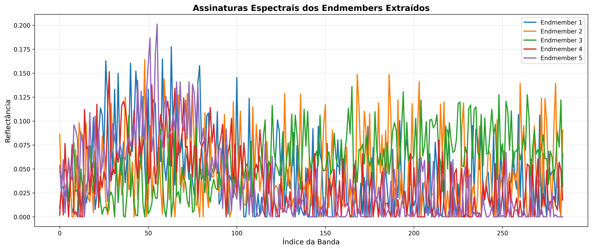
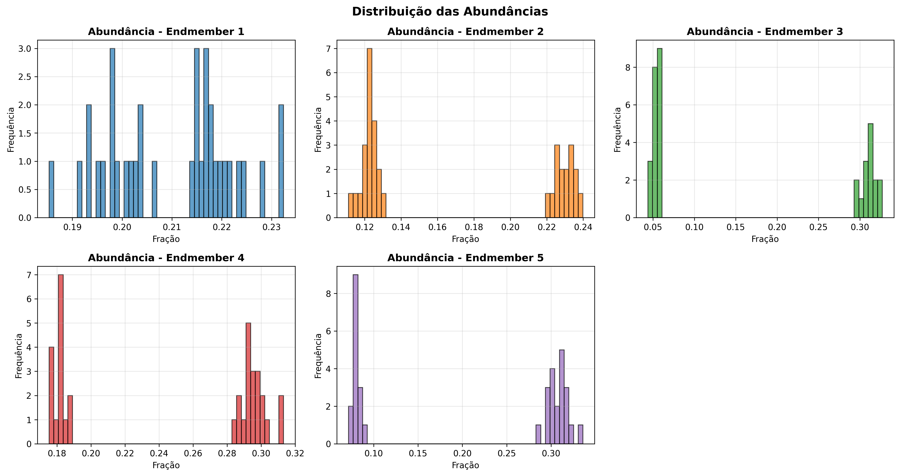
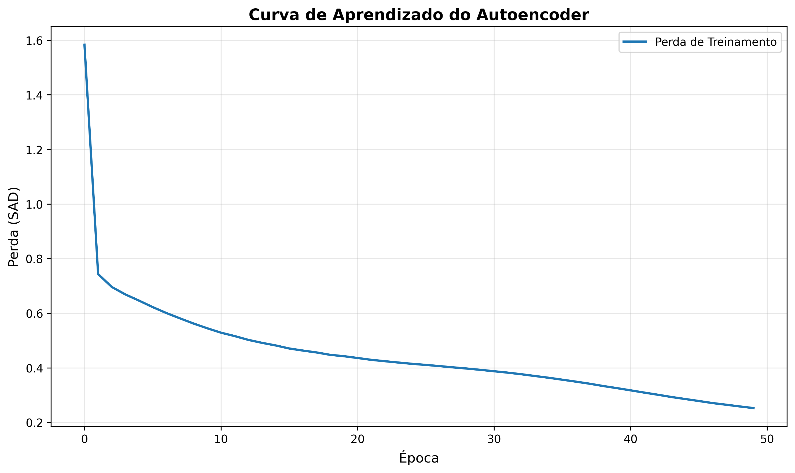
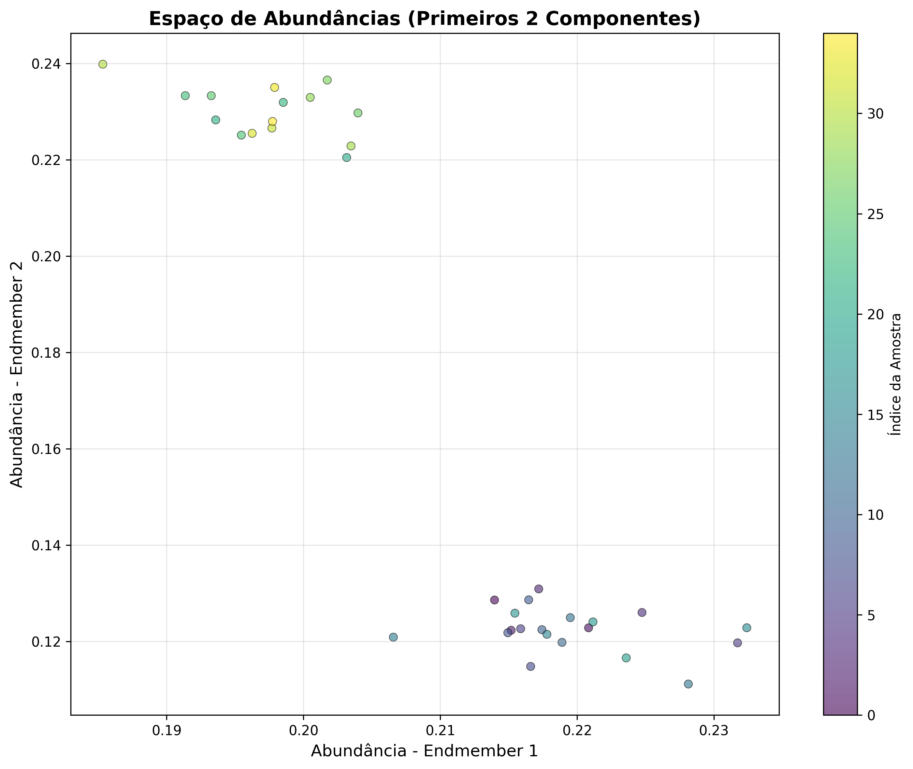

# Autoencoder para Recuperação de Assinaturas Espectrais EnMAP

## Visão Geral

Este módulo implementa um autoencoder com restrições físicas para extração não-supervisionada de endmembers (componentes espectrais puros) e abundâncias (frações de mistura) de dados hiperespectrais do satélite EnMAP e outros sensores.

## Características Principais

### 🎯 Restrições Físicas
- **ANC (Abundance Non-negativity Constraint)**: Abundâncias sempre ≥ 0
- **ASC (Abundance Sum-to-one Constraint)**: Σ(abundâncias) = 1
- **Endmembers não-negativos**: Componentes puros fisicamente plausíveis

### 🔬 Método Científico
- **Perda SAD**: Spectral Angle Divergence - independente de iluminação
- **Encoder profundo**: Dense layers com LeakyReLU
- **Decoder linear**: Representação direta dos endmembers
- **Otimização Adam**: Convergência rápida e estável

### 📊 Aplicações
- Extração de endmembers de imagens hiperespectrais
- Desmistura espectral não-supervisionada
- Análise de assinaturas espectrais EnMAP, PRISMA, EMIT
- Detecção de componentes puros em cenas mistas
- Redução de dimensionalidade preservando informação espectral

## Instalação

```bash
# Instalar dependências
pip install tensorflow numpy pandas matplotlib

# Ou usar requirements.txt do projeto
pip install -r requirements.txt
```

## Uso Rápido

### Exemplo Básico

```python
from spectral_analysis.autoencoder import SpectralAutoencoder
import numpy as np

# Seus dados espectrais (n_samples, n_bands)
X_data = np.load('your_spectral_data.npy')

# Criar autoencoder
autoencoder = SpectralAutoencoder(
    n_bands=224,        # Número de bandas (EnMAP tem 224)
    n_endmembers=5,     # Número de componentes a extrair
    hidden_units=128    # Tamanho da camada oculta
)

# Compilar e treinar
autoencoder.compile(learning_rate=0.001, loss='sad')
history = autoencoder.train(
    X_data,
    epochs=100,
    batch_size=32,
    normalize=True,
    validation_split=0.1
)

# Extrair resultados
endmembers = autoencoder.extract_endmembers()  # (5, 224)
abundances = autoencoder.extract_abundances(X_data)  # (n_samples, 5)

# Salvar modelo
autoencoder.save('my_autoencoder.keras')
```

### Usando Dados CSV

```python
from spectral_analysis.autoencoder import train_autoencoder_from_csv

# Treinar diretamente de arquivos CSV
autoencoder, endmembers, abundances, history = train_autoencoder_from_csv(
    csv_files=['data1.csv', 'data2.csv'],
    n_endmembers=5,
    epochs=100,
    wavelength_col_prefix='reflectance_',
    exclude_pattern='uncertainty'
)
```

### Exemplo Completo

Execute o script de exemplo fornecido:

```bash
python enmap_autoencoder_example.py
```

Este script irá:
1. Carregar dados de teste ou gerar dados sintéticos
2. Treinar o autoencoder
3. Extrair endmembers e abundâncias
4. Gerar visualizações
5. Salvar resultados em `test_data/autoencoder_results/`

## Visualizações

O módulo gera automaticamente várias visualizações:

### 1. Assinaturas Espectrais dos Endmembers


Mostra os componentes espectrais puros extraídos pelo autoencoder.

### 2. Distribuição das Abundâncias


Histogramas mostrando como cada endmember está distribuído nos dados.

### 3. Curva de Aprendizado


Evolução da perda (SAD) durante o treinamento.

### 4. Espaço de Abundâncias


Visualização 2D do espaço de abundâncias.

## Arquitetura do Autoencoder

```
Input (n_bands)
       ↓
┌──────────────────┐
│  Encoder         │
│  • Dense(128)    │  ← LeakyReLU
│  • Dense(n_end)  │  ← Softmax (ANC+ASC)
└──────────────────┘
       ↓
Abundances (n_endmembers)
       ↓
┌──────────────────┐
│  Decoder         │
│  • Dense(n_bands)│  ← Linear, NonNeg
└──────────────────┘
       ↓
Output (n_bands)

Loss: SAD(Input, Output)
```

## Parâmetros Principais

### SpectralAutoencoder

| Parâmetro | Tipo | Padrão | Descrição |
|-----------|------|--------|-----------|
| `n_bands` | int | - | Número de bandas espectrais |
| `n_endmembers` | int | - | Número de componentes a extrair |
| `hidden_units` | int | 128 | Neurônios na camada oculta do encoder |
| `leaky_alpha` | float | 0.02 | Parâmetro α do LeakyReLU |

### compile()

| Parâmetro | Tipo | Padrão | Descrição |
|-----------|------|--------|-----------|
| `learning_rate` | float | 0.001 | Taxa de aprendizado do otimizador Adam |
| `loss` | str/func | 'sad' | Função de perda ('sad' ou função do Keras) |

### train()

| Parâmetro | Tipo | Padrão | Descrição |
|-----------|------|--------|-----------|
| `X_train` | ndarray | - | Dados de treinamento (n_samples, n_bands) |
| `epochs` | int | 100 | Número de épocas |
| `batch_size` | int | 32 | Tamanho do batch |
| `normalize` | bool | True | Normalizar dados antes do treinamento |
| `validation_split` | float | 0.0 | Fração dos dados para validação |
| `verbose` | int | 1 | Nível de verbosidade (0, 1, ou 2) |

## Validação dos Resultados

### Verificar Restrições Físicas

```python
import numpy as np

# Verificar ANC (non-negativity)
assert np.all(abundances >= 0), "Abundâncias devem ser não-negativas"

# Verificar ASC (sum-to-one)
assert np.allclose(abundances.sum(axis=1), 1.0), "Abundâncias devem somar 1"

# Verificar endmembers não-negativos
assert np.all(endmembers >= 0), "Endmembers devem ser não-negativos"

print("✓ Todas as restrições físicas verificadas!")
```

### Avaliar Qualidade da Reconstrução

```python
# Reconstruir espectros
X_reconstructed = autoencoder.reconstruct(X_data)

# Calcular erro
mse = np.mean((X_data - X_reconstructed) ** 2)
print(f"Erro médio quadrático: {mse:.6f}")

# Calcular SAD médio
from spectral_analysis.autoencoder import sad_loss
import tensorflow as tf

sad_mean = sad_loss(
    tf.constant(X_data, dtype=tf.float32),
    tf.constant(X_reconstructed, dtype=tf.float32)
).numpy()
print(f"SAD médio: {sad_mean:.6f}")
```

## Testes

Execute os testes para validar a instalação:

```bash
python test_autoencoder.py
```

Os testes verificam:
- ✓ Construção da arquitetura
- ✓ Função de perda SAD
- ✓ Treinamento do modelo
- ✓ Extração de endmembers
- ✓ Extração de abundâncias
- ✓ Reconstrução de espectros
- ✓ Restrições físicas (ANC, ASC)

## Dados de Exemplo

### Formato CSV Esperado

```csv
reflectance_400.0,reflectance_410.0,reflectance_420.0,...
0.123,0.145,0.167,...
0.234,0.256,0.278,...
...
```

- Colunas começam com `reflectance_`
- Valores de reflectância entre 0 e 1
- Uma linha por espectro

### Gerar Dados Sintéticos

```python
import numpy as np

# Parâmetros
n_samples = 1000
n_bands = 224  # EnMAP
n_endmembers = 5

# Criar endmembers sintéticos
endmembers_true = np.random.rand(n_endmembers, n_bands) * 0.6 + 0.2

# Criar abundâncias (soma = 1)
abundances_true = np.random.dirichlet(np.ones(n_endmembers), n_samples)

# Criar espectros mistos
X_synthetic = abundances_true @ endmembers_true

# Adicionar ruído
noise = np.random.normal(0, 0.01, X_synthetic.shape)
X_synthetic = np.clip(X_synthetic + noise, 0, 1)

# Salvar
np.save('synthetic_spectra.npy', X_synthetic)
```

## Dicas de Uso

### Para Melhores Resultados

1. **Normalização**: Sempre normalize seus dados (`normalize=True`)
2. **Épocas**: Comece com 50-100 épocas, ajuste conforme necessário
3. **Número de Endmembers**: Teste diferentes valores (3-10 típico)
4. **Batch Size**: 32 funciona bem, ajuste para datasets maiores
5. **Learning Rate**: 0.001 é um bom ponto de partida
6. **Validação**: Use `validation_split=0.1` para monitorar overfitting

### Para Datasets Grandes

```python
# Use batch size maior e menos épocas
autoencoder.train(
    X_large,
    epochs=50,
    batch_size=128,
    validation_split=0.05
)
```

### Para Visualizar Durante o Treinamento

```python
from tensorflow.keras.callbacks import TensorBoard

# Criar callback
tensorboard = TensorBoard(log_dir='./logs')

# Treinar com callback
history = autoencoder.train(
    X_data,
    epochs=100,
    callbacks=[tensorboard]
)

# Visualizar: tensorboard --logdir=./logs
```

## Troubleshooting

### GPU não detectada
```
Could not find cuda drivers on your machine, GPU will not be used.
```
**Solução**: Normal se você não tem GPU. O código roda bem em CPU.

### Erro de memória
```
ResourceExhaustedError: OOM when allocating tensor
```
**Solução**: Reduza `batch_size` ou o número de amostras.

### Perda não diminui
**Soluções**:
- Aumentar `learning_rate`
- Verificar se dados estão normalizados
- Tentar mais épocas
- Verificar qualidade dos dados de entrada

### Endmembers muito similares
**Soluções**:
- Reduzir número de endmembers
- Aumentar diversidade nos dados de treinamento
- Ajustar arquitetura (mais `hidden_units`)

## Contribuindo

Para contribuir com melhorias:

1. Fork o repositório
2. Crie uma branch para sua feature
3. Faça commit das mudanças
4. Envie um pull request

## Licença

Este projeto é parte do trabalho de doutorado em Sensoriamento Remoto.

## Referências

- **Spectral Angle Mapper**: Kruse et al. (1993) - Métrica para comparação espectral
- **Autoencoders for Unmixing**: Palsson et al. (2018) - Uso de autoencoders em desmistura
- **Physics-Constrained Deep Learning**: Várias aplicações em sensoriamento remoto

## Contato

Para questões sobre o autoencoder, abra uma issue no GitHub ou entre em contato com o autor do projeto.

---

**Desenvolvido para análise de dados hiperespectrais EnMAP, PRISMA e EMIT** 🛰️
